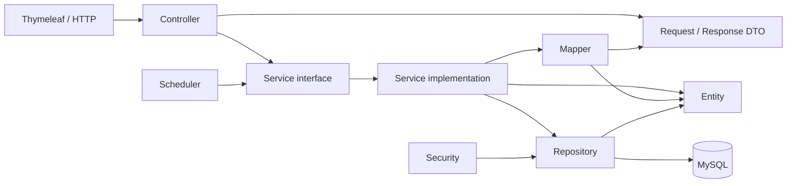

# AURA Store

AURA Store là hệ thống quản lý và bán giày trực tuyến được xây dựng bằng Spring Boot, Spring MVC và Thymeleaf. Dự án phục vụ đồ án môn học, đồng thời được tổ chức theo các quy ước gần với một dự án thực tế để nhiều thành viên có thể phát triển song song.

> Trạng thái hiện tại: bộ khung kiến trúc đã được tạo đầy đủ. Entity, DTO,
> repository, mapper, service implementation, controller và giao diện hiện là
> skeleton có thể biên dịch; trường dữ liệu, chữ ký use case và nghiệp vụ sẽ
> được hoàn thiện theo từng Pull Request.

## Mục lục

- [Phạm vi nghiệp vụ](#phạm-vi-nghiệp-vụ)
- [Công nghệ](#công-nghệ)
- [Kiến trúc](#kiến-trúc)
- [Cấu trúc package](#cấu-trúc-package)
- [Nguyên tắc phụ thuộc](#nguyên-tắc-phụ-thuộc)
- [Thiết kế database](#thiết-kế-database)
- [Yêu cầu môi trường](#yêu-cầu-môi-trường)
- [Cài đặt và chạy dự án](#cài-đặt-và-chạy-dự-án)
- [Quản lý database bằng Flyway](#quản-lý-database-bằng-flyway)
- [Quy ước phát triển](#quy-ước-phát-triển)
- [Quy trình Git](#quy-trình-git)
- [Kiểm thử](#kiểm-thử)
- [Trạng thái triển khai](#trạng-thái-triển-khai)

## Phạm vi nghiệp vụ

Hệ thống dự kiến hỗ trợ các nhóm chức năng sau:

- Đăng ký, đăng nhập bằng tài khoản nội bộ và Google OAuth2.
- Quản lý tài khoản khách hàng và nhân viên.
- Phân quyền nhân viên dựa trên permission.
- Quản lý thương hiệu, danh mục, sản phẩm, biến thể và hình ảnh.
- Quản lý nhà cung cấp và đơn đặt hàng nhà cung cấp.
- Nhập kho, xuất kho, điều chỉnh tồn kho và theo dõi lịch sử kho.
- Giỏ hàng, giữ hàng có thời hạn và danh sách yêu thích.
- Voucher và phương thức vận chuyển.
- Checkout, đơn hàng, lịch sử trạng thái và thanh toán.
- Trả hàng, đổi hàng, hoàn tiền và đánh giá sản phẩm.
- Báo cáo doanh thu, đơn hàng, sản phẩm và tồn kho.
- Audit log phục vụ truy vết thay đổi và sự kiện bảo mật.

## Công nghệ

| Thành phần | Công nghệ |
|---|---|
| Ngôn ngữ | Java 25 |
| Backend | Spring Boot 3.5.16, Spring MVC |
| View engine | Thymeleaf |
| Bảo mật | Spring Security, OAuth2 Client |
| Persistence | Spring Data JPA, Hibernate |
| Database | MySQL 8.0 |
| Migration | Flyway |
| Mapping | MapStruct |
| Validation | Jakarta Bean Validation |
| Build | Maven Wrapper |
| Đóng gói | Executable JAR với embedded Tomcat |
| Testing | JUnit, Spring Boot Test, Spring Security Test, Mockito |

Phiên bản chính xác của thư viện được quản lý tại [`pom.xml`](pom.xml). Không tự ý khai báo version riêng cho dependency đã được Spring Boot dependency management quản lý.

## Kiến trúc

Dự án sử dụng **layered architecture theo package dùng chung**. Mỗi tầng có trách nhiệm rõ ràng và không được bỏ qua service để truy cập repository trực tiếp từ controller.



Luồng xử lý thông thường:

```text
HTTP request
    → Controller
    → Request DTO + Validation
    → Service interface
    → Service implementation
    → Repository
    → MySQL
    → Mapper
    → Response DTO / Thymeleaf Model
    → HTML response
```

### Quyết định kiến trúc đã chốt

- Service sử dụng `interface + impl`.
- Controller chỉ làm việc với DTO; không nhận hoặc trả entity trực tiếp.
- DTO được chia thành `request` và `response`.
- `service.impl` là package con của `service`.
- JPA Auditing quản lý timestamp ở Java; database vẫn giữ default timestamp.
- Có hai base entity: `CreatedAtEntity` và `TimestampedEntity`; không có base ID dùng chung.
- `security` không sở hữu entity và sử dụng permission làm authority.
- `reporting` là nghiệp vụ chỉ đọc và không sở hữu entity riêng.
- Scheduler giải phóng các lượt giữ hàng hết hạn thông qua `CartService`.
- Các lớp kỹ thuật dùng chung không được chứa nghiệp vụ của một module cụ thể.

## Cấu trúc package

Base package của dự án:

```text
com.aura.store
```

Cấu trúc mục tiêu:

```text
com.aura.store
├── config
├── controller
│   ├── auth
│   ├── storefront
│   └── management
├── dto
│   ├── request
│   └── response
├── entity
├── enums
├── repository
├── service
│   └── impl
├── mapper
├── security
│   ├── principal
│   ├── handler
│   └── oauth2
├── scheduler
├── validation
│   ├── annotation
│   └── validator
└── exception
```

### Trách nhiệm của package

| Package | Trách nhiệm |
|---|---|
| `config` | Cấu hình Spring, MVC, JPA, auditing và các bean dùng chung |
| `controller` | Nhận HTTP request, gọi service và chọn view/response |
| `controller.auth` | Đăng ký, đăng nhập, quên mật khẩu và OAuth2 |
| `controller.storefront` | Luồng dành cho khách mua hàng |
| `controller.management` | Màn hình quản trị dành cho nhân viên |
| `dto.request` | Dữ liệu đầu vào của form hoặc API |
| `dto.response` | Dữ liệu trả về cho view hoặc API |
| `entity` | JPA entity ánh xạ database |
| `enums` | Các enum được dùng bởi entity và DTO |
| `repository` | Spring Data JPA repository và truy vấn dữ liệu |
| `service` | Hợp đồng use case/nghiệp vụ |
| `service.impl` | Triển khai service và transaction boundary |
| `mapper` | Chuyển đổi entity ↔ DTO bằng MapStruct |
| `security` | Cấu hình và thành phần xác thực/phân quyền |
| `scheduler` | Tác vụ nền, không chứa nghiệp vụ chính |
| `validation` | Custom validation annotation và validator |
| `exception` | Exception nghiệp vụ và xử lý lỗi tập trung |

### Service interface hiện có

Các interface được nhóm theo aggregate/use case, không tạo máy móc một service cho mỗi bảng:

- Tài khoản và phân quyền: `AuthenticationService`, `AccountService`, `CustomerService`, `StaffService`, `AuthorizationService`, `AddressService`.
- Catalog: `BrandService`, `CategoryService`, `ProductService`.
- Mua hàng và kho: `SupplierService`, `PurchaseOrderService`, `InventoryService`.
- Storefront: `CartService`, `WishlistService`, `VoucherService`, `ShippingMethodService`.
- Đơn hàng: `CheckoutService`, `OrderService`, `PaymentService`.
- Hậu mãi: `AfterSalesService`, `ReviewService`.
- Hỗ trợ: `ReportingService`, `AuditLogService`, `EmailService`.

Interface chỉ nên chứa chữ ký thể hiện use case. Không đưa JPA query, HTTP object hoặc chi tiết framework vào service interface.

### Phạm vi của architecture skeleton

Các file đã tồn tại để thành viên không phải tự quyết định lại cấu trúc dự án:

- 29 entity tương ứng 29 bảng, hai base entity và khóa ghép `RolePermissionId`.
- 29 Spring Data repository.
- Request/response DTO cho các use case chắc chắn có.
- 24 service interface và implementation shell tương ứng.
- Mapper contract theo aggregate chính.
- Controller cho authentication, storefront và management.
- Security, JPA auditing, scheduling, exception handling và phone validation.
- Template Thymeleaf, fragment dùng chung, CSS và JavaScript nền.

Skeleton **không được xem là feature đã hoàn thành**. Entity hiện chỉ ánh xạ
table, ID và timestamp chắc chắn; association và business field được bổ sung khi
thành viên triển khai feature. DTO/mapper/service implementation cũng chỉ là
điểm mở rộng, không chứa dữ liệu hoặc nghiệp vụ giả.

## Nguyên tắc phụ thuộc

Các dependency hợp lệ:

```text
controller → service, dto
scheduler → service
service.impl → repository, mapper, entity, dto, exception
repository → entity
mapper → entity, dto
validation → dto
entity → enums
dto → enums
security → repository, entity
config → security và thành phần kỹ thuật cần cấu hình
```

Không chấp nhận:

- `controller → repository`.
- `controller → service.impl`; controller phải phụ thuộc interface.
- `repository → service`.
- `entity → controller`, `dto`, `service` hoặc `repository`.
- `scheduler` tự viết lại nghiệp vụ thay vì gọi service.
- Reporting thay đổi dữ liệu nghiệp vụ.

## Thiết kế database

Schema cập nhật sử dụng 29 bảng, 2 view và 13 trigger. Bảng
`google_oauth_tokens` được tách riêng khỏi `accounts` để lưu thông tin liên kết
Google OAuth. Các đối tượng database được chia thành các nhóm chính:

- IAM/RBAC: tài khoản, khách hàng, nhân viên, role, permission và audit log.
- Catalog: thương hiệu, danh mục, sản phẩm, biến thể và hình ảnh.
- Procurement/Inventory: nhà cung cấp, đơn mua, phiếu kho và sổ giao dịch kho.
- Storefront: giỏ hàng, wishlist, voucher và vận chuyển.
- Sales: đơn hàng, dòng đơn, lịch sử trạng thái và thanh toán.
- After-sales: trả/đổi/hoàn tiền và đánh giá.

### Quy tắc database quan trọng

- `accounts` là danh tính đăng nhập chung; `customers` và `staffs` dùng shared primary key với `accounts`.
- Tồn hiện tại nằm ở `product_variants.stock_quantity`.
- Tồn khả dụng bằng tồn thực tế trừ số lượng đang được giữ.
- Không cập nhật trực tiếp tồn kho từ service thông thường.
- Mọi biến động kho phải đi qua `inventory_documents` và `inventory_transactions`.
- Giao dịch kho và audit log là append-only; không update hoặc delete.
- Đơn hàng lưu snapshot sản phẩm, giá, địa chỉ và phương thức vận chuyển để bảo toàn lịch sử.
- Checkout, ghi sổ kho và các quy trình nhiều bước phải chạy trong transaction.
- Payment callback và stock transaction phải có idempotency key.

## Yêu cầu môi trường

Trước khi chạy dự án, cần cài:

- JDK 25.
- IntelliJ IDEA hỗ trợ Java 25.
- MySQL Community Server 8.4.
- Git.

Không bắt buộc cài Maven toàn hệ thống vì repository sử dụng Maven Wrapper.

Kiểm tra môi trường:

```powershell
java -version
git --version
.\mvnw.cmd -version
```

Trên macOS/Linux:

```bash
./mvnw -version
```

## Cài đặt và chạy dự án

### 1. Clone repository

```bash
git clone <repository-url>
cd <repository-directory>
```

Mở `pom.xml` bằng IntelliJ và chọn **Load Maven Project**.

Thiết lập:

```text
Project SDK: JDK 25
Maven Runner JRE: Project SDK 25
Annotation Processing: Enabled
```

### 2. Tạo database local

Đăng nhập MySQL bằng tài khoản quản trị và chạy:

```sql
CREATE DATABASE IF NOT EXISTS aura_store
    CHARACTER SET utf8mb4
    COLLATE utf8mb4_vi_0900_ai_ci;

CREATE USER IF NOT EXISTS 'aura_app'@'localhost'
    IDENTIFIED BY 'your_local_password';

GRANT ALL PRIVILEGES
    ON aura_store.*
    TO 'aura_app'@'localhost';

FLUSH PRIVILEGES;
```

Chỉ tạo **database rỗng**. Không chạy thêm clean-install SQL bằng tay vì Flyway
sẽ tự tạo 29 bảng, 2 view, 13 trigger và dữ liệu role/permission khi ứng dụng
khởi động lần đầu.

Không sử dụng tài khoản `root` làm datasource của ứng dụng.

> Nếu `aura_store` đã được tạo đầy đủ bằng clean-install script cũ, Flyway sẽ
> từ chối schema không rỗng nhưng chưa có `flyway_schema_history`. Hãy sao lưu
> dữ liệu cần giữ và trao đổi với trưởng nhóm trước khi tạo lại database rỗng.
> Không tự bật `baseline-on-migrate` để bỏ qua lỗi này.

### 3. Khai báo biến môi trường

Tạo Run Configuration cho `AuraShoreStoreApplication` trong IntelliJ và khai báo:

| Biến | Bắt buộc | Ví dụ |
|---|---:|---|
| `SPRING_PROFILES_ACTIVE` | Không | `dev` |
| `AURA_DB_USERNAME` | Không | `aura_app` |
| `AURA_DB_PASSWORD` | Có | Mật khẩu local của thành viên |
| `AURA_DB_URL` | Không | `jdbc:mysql://localhost:3306/aura_store?...` |
| `AURA_DB_POOL_MAX_SIZE` | Không | `10` |
| `AURA_DB_POOL_MIN_IDLE` | Không | `2` |

Không commit mật khẩu, API key, OAuth secret hoặc mail credential lên Git.

Spring Boot không tự động đọc file `.env`. Hãy dùng Environment Variables của IntelliJ hoặc biến môi trường của hệ điều hành.

#### Cấu hình riêng trên máy từng thành viên

Các file cấu hình dùng chung có trách nhiệm như sau:

| File | Có commit? | Mục đích |
|---|---:|---|
| `application.yml` | Có | Cấu hình chung: JPA, Flyway, profile mặc định |
| `application-dev.yml` | Có | Giá trị mặc định cho môi trường phát triển và biến môi trường |
| `application-local.yml.example` | Có | Mẫu cấu hình riêng cho từng máy |
| `application-local.yml` | Không | Username, password, host hoặc port riêng của thành viên |

Cách khuyến nghị là giữ `SPRING_PROFILES_ACTIVE=dev` và khai báo ba biến trong
IntelliJ Run Configuration:

```text
AURA_DB_URL=jdbc:mysql://localhost:3306/aura_store?useUnicode=true&characterEncoding=UTF-8&connectionTimeZone=UTC&sslMode=DISABLED&allowPublicKeyRetrieval=true
AURA_DB_USERNAME=aura_app
AURA_DB_PASSWORD=<your_local_password>
```

Nếu muốn dùng file local:

1. Sao chép `application-local.yml.example` thành `application-local.yml`.
2. Sửa `url`, `username` và `password` trong bản sao.
3. Đặt `SPRING_PROFILES_ACTIVE=dev,local` để profile `local` ghi đè `dev`.
4. Không dùng `git add -f` với `application-local.yml`; file này đã được `.gitignore` bảo vệ.

Không sửa `application-dev.yml` chỉ để phù hợp máy cá nhân. Chỉ sửa file dùng
chung khi cả nhóm thống nhất đổi tên database, timezone hoặc chính sách kết nối.

### 4. Build

Windows PowerShell:

```powershell
.\mvnw.cmd clean verify
```

macOS/Linux:

```bash
./mvnw clean verify
```

### 5. Chạy ứng dụng

Chạy trực tiếp trong IntelliJ hoặc dùng:

```powershell
.\mvnw.cmd spring-boot:run
```

Khi chạy lần đầu, log thành công cần có các dấu hiệu tương tự:

```text
AuraHikariPool - Start completed
Successfully applied 1 migration
Tomcat started on port 8080
```

Kiểm tra từ MySQL:

```sql
USE aura_store;

SELECT version, description, success
FROM flyway_schema_history
ORDER BY installed_rank;

SELECT COUNT(*) AS base_table_count
FROM information_schema.tables
WHERE table_schema = 'aura_store'
  AND table_type = 'BASE TABLE';
```

Kết quả migration ban đầu phải thành công. Schema nghiệp vụ có 29 bảng; MySQL
còn hiển thị thêm `flyway_schema_history` do Flyway quản lý.

Ứng dụng mặc định chạy tại:

```text
http://localhost:8080
```

### 6. Đóng gói JAR

```powershell
.\mvnw.cmd clean package
java -jar target/aura-store-0.0.1-SNAPSHOT.jar
```

HTML/Thymeleaf, CSS, JavaScript và hình ảnh được đóng gói bên trong executable JAR.

```text
src/main/resources
├── templates
│   ├── auth
│   ├── storefront
│   ├── management
│   └── fragments
└── static
    ├── css
    ├── js
    └── images
```

## Quản lý database bằng Flyway

Flyway là nguồn duy nhất quản lý thay đổi schema. Hibernate được cấu hình `ddl-auto: validate` và không tự tạo/sửa bảng.

Migration đặt tại:

```text
src/main/resources/db/migration
```

Migration khởi tạo hiện tại:

```text
V1__initialize_aura_schema.sql
```

Migration này được tạo từ bản SQL cập nhật, bao gồm 29 bảng, 2 view, 13 trigger
và dữ liệu nền cho role, permission, role-permission. Nó không chứa
`DROP DATABASE`, `CREATE DATABASE`, `USE` hoặc các câu lệnh kiểm tra cài đặt.

Migration tiếp theo đặt tên tăng dần:

```text
V2__short_description.sql
V3__short_description.sql
```

Quy tắc:

1. Không đặt `DROP DATABASE`, `CREATE DATABASE` hoặc `USE database` trong migration.
2. Không sửa migration đã được merge hoặc đã chạy trên máy thành viên khác.
3. Mỗi thay đổi schema phải tạo migration mới.
4. Không bật `baseline-on-migrate` để che giấu database sai trạng thái.
5. Không dùng cả Flyway và `schema.sql`/`data.sql` cho cùng một schema.
6. Kiểm tra lịch sử bằng bảng `flyway_schema_history`.

Flyway hỗ trợ cú pháp `DELIMITER` của MySQL, vì vậy các trigger trong migration
khởi tạo được giữ nguyên.

### Xử lý lỗi kết nối thường gặp

| Lỗi | Nguyên nhân thường gặp | Cách xử lý |
|---|---|---|
| `Unknown database 'aura_store'` | Chưa tạo database hoặc vẫn dùng tên cũ | Tạo database rỗng `aura_store`; kiểm tra `AURA_DB_URL` |
| `Access denied for user` | Sai username/password hoặc chưa `GRANT` | Kiểm tra biến môi trường và quyền của `aura_app` |
| `Communications link failure` | MySQL chưa chạy hoặc sai host/port | Khởi động MySQL; kiểm tra port trong JDBC URL |
| `Found non-empty schema but no schema history table` | Đã chạy clean-install SQL bằng tay | Sao lưu và tạo lại database rỗng; không bật baseline tùy tiện |
| `Validate failed: Migration checksum mismatch` | Đã sửa migration từng được chạy | Khôi phục migration gốc và tạo migration version mới |
| `Unable to resolve AURA_DB_PASSWORD` | Chưa khai báo mật khẩu | Thêm biến trong IntelliJ hoặc dùng `application-local.yml` |

## Quy ước phát triển

### Java

- Class/interface: `PascalCase`.
- Method/field/local variable: `camelCase`.
- Constant: `UPPER_SNAKE_CASE`.
- Package: chữ thường, không có dấu gạch dưới.
- Ưu tiên constructor injection; không dùng field injection.
- Không dùng `@Data` cho JPA entity.
- Không đưa logic nghiệp vụ vào controller, entity setter hoặc scheduler.
- Không trả entity trực tiếp ra HTTP response.
- Dùng `BigDecimal` cho tiền; không dùng `double` hoặc `float`.
- Dùng enum thay cho chuỗi tự do đối với trạng thái hữu hạn.
- Các phương thức ghi nhiều bảng phải xác định rõ `@Transactional` tại service implementation.
- Chỉ bắt exception khi có thể xử lý hoặc chuyển thành exception có ý nghĩa hơn.

### Service

- Interface nằm trong `service`; implementation nằm trong `service.impl`.
- Tên implementation theo dạng `ProductServiceImpl`.
- Controller inject `ProductService`, không inject `ProductServiceImpl`.
- Không tạo một service chỉ vì có một bảng; service đại diện aggregate hoặc use case.
- Interface dùng DTO/domain value phù hợp, không để lộ `HttpServletRequest`, `Model` hoặc lớp repository.

### DTO và validation

- DTO đầu vào đặt trong `dto.request` và kết thúc bằng `Request`.
- DTO đầu ra đặt trong `dto.response` và kết thúc bằng `Response`.
- Dùng Bean Validation cho kiểm tra định dạng và ràng buộc đơn giản.
- Ràng buộc cần truy cập database phải được kiểm tra ở service.
- Mapper chỉ chuyển đổi dữ liệu; không chứa truy vấn hoặc nghiệp vụ.

### Entity và JPA

- Chỉ tạo association phục vụ truy vấn/nghiệp vụ thực tế.
- Mặc định cân nhắc `LAZY` cho quan hệ collection.
- Không đưa collection lớn vào `toString`, `equals` hoặc `hashCode`.
- Không tự động cascade mọi thao tác nếu chưa phân tích ownership.
- `CreatedAtEntity` chỉ có `createdAt`.
- `TimestampedEntity` có `createdAt` và `updatedAt`.
- Mỗi entity tự khai báo kiểu ID phù hợp; không dùng base ID chung.

### Thymeleaf

- Template đặt trong `src/main/resources/templates`.
- CSS, JavaScript và ảnh tĩnh đặt trong `src/main/resources/static`.
- Thành phần dùng lại đặt trong `templates/fragments`.
- Controller trả tên view, ví dụ `storefront/home`, không trả đường dẫn file tuyệt đối.
- Dùng biểu thức URL Thymeleaf `@{...}` để tạo đường dẫn tài nguyên.

### Security

- Permission key là Spring Security authority, ví dụ `catalog.manage`.
- Role dùng để gom permission, không dùng role thay thế toàn bộ kiểm tra quyền.
- Không lưu mật khẩu dạng rõ; sử dụng password encoder được cấu hình tập trung.
- Không log password, token, OAuth secret hoặc dữ liệu thanh toán nhạy cảm.
- Mọi kiểm tra ownership của khách hàng phải thực hiện ở service, không chỉ ẩn nút trên giao diện.

## Quy trình Git

Quy trình nhóm đã thống nhất:

```text
Thành viên tạo branch
    → code và commit
    → push branch
    → tạo Pull Request
    → trưởng nhóm review
    → sửa theo review
    → trưởng nhóm approve và merge
```

Không commit trực tiếp vào `main`.

### Đặt tên branch

```text
feature/product-management
feature/customer-registration
fix/cart-reservation
refactor/order-service
docs/update-readme
```

### Commit message

Khuyến nghị Conventional Commits:

```text
feat: add product service methods
fix: prevent expired cart reservation
refactor: extract order mapper
test: add voucher validation tests
docs: update local setup guide
chore: update Maven configuration
```

Mỗi commit nên:

- Chỉ tập trung vào một thay đổi có ý nghĩa.
- Build được và không chứa secret.
- Không commit `target`, log, file IDE cá nhân hoặc dữ liệu database.
- Không trộn format toàn dự án vào commit nghiệp vụ không liên quan.

### Pull Request checklist

Trước khi yêu cầu review:

- [ ] Code đúng package và dependency direction.
- [ ] Không sửa ngoài phạm vi nhiệm vụ.
- [ ] Có validation và xử lý lỗi phù hợp.
- [ ] Có transaction cho use case ghi nhiều bảng.
- [ ] Có migration nếu schema thay đổi.
- [ ] Có test cho nghiệp vụ mới hoặc lỗi được sửa.
- [ ] `mvnw clean verify` chạy thành công.
- [ ] Không có mật khẩu, token hoặc dữ liệu cá nhân trong commit.
- [ ] PR mô tả cách kiểm thử thủ công nếu có giao diện.

## Kiểm thử

Chiến lược ban đầu khi chưa sử dụng Docker:

- Unit test: JUnit và Mockito, không cần database.
- Repository/integration test: database MySQL test trên máy thành viên.
- Không dùng H2 thay MySQL cho các truy vấn phụ thuộc trigger, view, generated column hoặc cú pháp MySQL.
- Mỗi thành viên nên có database riêng cho test, ví dụ `aura_store_test`.
- Test không được trỏ vào database phát triển có dữ liệu quan trọng.

Chạy toàn bộ test:

```powershell
.\mvnw.cmd test
```

Chạy kiểm tra đầy đủ trước Pull Request:

```powershell
.\mvnw.cmd clean verify
```

## Trạng thái triển khai

| Hạng mục | Trạng thái |
|---|---|
| Maven project và Java 25 | Đã khởi tạo |
| Cấu hình Spring Boot cơ bản | Đã khởi tạo |
| Cấu hình datasource local | Đã khởi tạo |
| Service interfaces | Đã tạo |
| Package architecture | Đã tạo đầy đủ skeleton |
| Flyway migration khởi tạo | Đã tạo từ SQL cập nhật |
| Entity và enum | Đã có skeleton; business fields đang chờ triển khai |
| Repository và mapper | Đã có skeleton; query/mapping đang chờ triển khai |
| Service implementations | Đã có implementation shell |
| Security configuration | Đã có cấu hình nền; authorization chi tiết đang chờ triển khai |
| Controllers và Thymeleaf UI | Đã có route và trang skeleton |
| Automated tests | Có smoke test; feature test đang chờ triển khai |
| Docker | Chưa sử dụng ở giai đoạn hiện tại |

Khi hoàn thành một hạng mục, Pull Request triển khai hạng mục đó phải cập nhật lại bảng trạng thái nếu cần.

---

Nếu chưa chắc một class thuộc package nào hoặc một use case nên nằm ở service nào, hãy trao đổi với trưởng nhóm trước khi tạo thêm package hoặc dependency mới.
