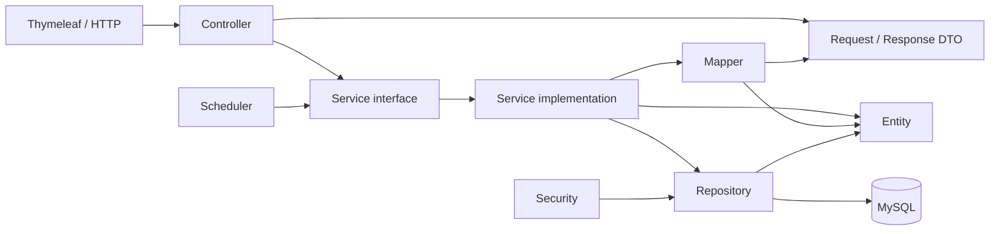

# AURA Store

AURA Store là hệ thống quản lý và bán giày trực tuyến được xây dựng bằng Spring Boot, Spring MVC và Thymeleaf. Dự án phục vụ đồ án môn học, đồng thời được tổ chức theo các quy ước gần với một dự án thực tế để nhiều thành viên có thể phát triển song song.

> Trạng thái hiện tại: bộ khung kiến trúc đã được tạo đầy đủ. Entity, DTO,
> repository, mapper, service implementation, controller và giao diện hiện là
> skeleton có thể biên dịch; trường dữ liệu, chữ ký use case và nghiệp vụ sẽ
> được hoàn thiện theo từng Pull Request.

## Mục lục

- [Phạm vi nghiệp vụ](#phạm-vi-nghiệp-vụ)
- [Công nghệ](#công-nghệ)
- [Kiến trúc](#kiến-trúc)
- [Cấu trúc package](#cấu-trúc-package)
- [Nguyên tắc phụ thuộc](#nguyên-tắc-phụ-thuộc)
- [Thiết kế database](#thiết-kế-database)
- [Yêu cầu môi trường](#yêu-cầu-môi-trường)
- [Cài đặt và chạy dự án](#cài-đặt-và-chạy-dự-án)
- [Quản lý database bằng Flyway](#quản-lý-database-bằng-flyway)
- [Quy ước phát triển](#quy-ước-phát-triển)
- [Quy trình Git](#quy-trình-git)
- [Kiểm thử](#kiểm-thử)
- [Trạng thái triển khai](#trạng-thái-triển-khai)

## Phạm vi nghiệp vụ

Hệ thống dự kiến hỗ trợ các nhóm chức năng sau:

- Đăng ký, đăng nhập bằng tài khoản nội bộ và Google OAuth2.
- Quản lý tài khoản khách hàng và nhân viên.
- Phân quyền nhân viên dựa trên permission.
- Quản lý thương hiệu, danh mục, sản phẩm, biến thể và hình ảnh.
- Quản lý nhà cung cấp và đơn đặt hàng nhà cung cấp.
- Nhập kho, xuất kho, điều chỉnh tồn kho và theo dõi lịch sử kho.
- Giỏ hàng, giữ hàng có thời hạn và danh sách yêu thích.
- Voucher và phương thức vận chuyển.
- Checkout, đơn hàng, lịch sử trạng thái và thanh toán.
- Trả hàng, đổi hàng, hoàn tiền và đánh giá sản phẩm.
- Báo cáo doanh thu, đơn hàng, sản phẩm và tồn kho.
- Audit log phục vụ truy vết thay đổi và sự kiện bảo mật.

## Công nghệ

| Thành phần | Công nghệ |
|---|---|
| Ngôn ngữ | Java 25 |
| Backend | Spring Boot 3.5.16, Spring MVC |
| View engine | Thymeleaf |
| Bảo mật | Spring Security, OAuth2 Client |
| Persistence | Spring Data JPA, Hibernate |
| Database | MySQL 8.0 |
| Migration | Flyway |
| Mapping | MapStruct |
| Validation | Jakarta Bean Validation |
| Build | Maven Wrapper |
| Đóng gói | Executable JAR với embedded Tomcat |
| Testing | JUnit, Spring Boot Test, Spring Security Test, Mockito |

Phiên bản chính xác của thư viện được quản lý tại [`pom.xml`](pom.xml). Không tự ý khai báo version riêng cho dependency đã được Spring Boot dependency management quản lý.

## Kiến trúc

Dự án sử dụng **layered architecture theo package dùng chung**. Mỗi tầng có trách nhiệm rõ ràng và không được bỏ qua service để truy cập repository trực tiếp từ controller.



Luồng xử lý thông thường:

```text
HTTP request
    → Controller
    → Request DTO + Validation
    → Service interface
    → Service implementation
    → Repository
    → MySQL
    → Mapper
    → Response DTO / Thymeleaf Model
    → HTML response
```

### Quyết định kiến trúc đã chốt

- Service sử dụng `interface + impl`.
- Controller chỉ làm việc với DTO; không nhận hoặc trả entity trực tiếp.
- DTO được chia thành `request` và `response`.
- `service.impl` là package con của `service`.
- JPA Auditing quản lý timestamp ở Java; database vẫn giữ default timestamp.
- Có hai base entity: `CreatedAtEntity` và `TimestampedEntity`; không có base ID dùng chung.
- `security` không sở hữu entity và sử dụng permission làm authority.
- `reporting` là nghiệp vụ chỉ đọc và không sở hữu entity riêng.
- Scheduler giải phóng các lượt giữ hàng hết hạn thông qua `CartService`.
- Các lớp kỹ thuật dùng chung không được chứa nghiệp vụ của một module cụ thể.

## Cấu trúc package

Base package của dự án:

```text
com.aura.store
```

Cấu trúc mục tiêu:

```text
com.aura.store
├── config
├── controller
│   ├── auth
│   ├── storefront
│   └── management
├── dto
│   ├── request
│   └── response
├── entity
├── enums
├── repository
├── service
│   └── impl
├── mapper
├── security
│   ├── principal
│   ├── handler
│   └── oauth2
├── scheduler
├── validation
│   ├── annotation
│   └── validator
└── exception
```

### Trách nhiệm của package

| Package | Trách nhiệm |
|---|---|
| `config` | Cấu hình Spring, MVC, JPA, auditing và các bean dùng chung |
| `controller` | Nhận HTTP request, gọi service và chọn view/response |
| `controller.auth` | Đăng ký, đăng nhập, quên mật khẩu và OAuth2 |
| `controller.storefront` | Luồng dành cho khách mua hàng |
| `controller.management` | Màn hình quản trị dành cho nhân viên |
| `dto.request` | Dữ liệu đầu vào của form hoặc API |
| `dto.response` | Dữ liệu trả về cho view hoặc API |
| `entity` | JPA entity ánh xạ database |
| `enums` | Các enum được dùng bởi entity và DTO |
| `repository` | Spring Data JPA repository và truy vấn dữ liệu |
| `service` | Hợp đồng use case/nghiệp vụ |
| `service.impl` | Triển khai service và transaction boundary |
| `mapper` | Chuyển đổi entity ↔ DTO bằng MapStruct |
| `security` | Cấu hình và thành phần xác thực/phân quyền |
| `scheduler` | Tác vụ nền, không chứa nghiệp vụ chính |
| `validation` | Custom validation annotation và validator |
| `exception` | Exception nghiệp vụ và xử lý lỗi tập trung |

### Service interface hiện có

Các interface được nhóm theo aggregate/use case, không tạo máy móc một service cho mỗi bảng:

- Tài khoản và phân quyền: `AuthenticationService`, `AccountService`, `CustomerService`, `StaffService`, `AuthorizationService`, `AddressService`.
- Catalog: `BrandService`, `CategoryService`, `ProductService`.
- Mua hàng và kho: `SupplierService`, `PurchaseOrderService`, `InventoryService`.
- Storefront: `CartService`, `WishlistService`, `VoucherService`, `ShippingMethodService`.
- Đơn hàng: `CheckoutService`, `OrderService`, `PaymentService`.
- Hậu mãi: `AfterSalesService`, `ReviewService`.
- Hỗ trợ: `ReportingService`, `AuditLogService`, `EmailService`.

Interface chỉ nên chứa chữ ký thể hiện use case. Không đưa JPA query, HTTP object hoặc chi tiết framework vào service interface.

### Phạm vi của architecture skeleton

Các file đã tồn tại để thành viên không phải tự quyết định lại cấu trúc dự án:

- 28 entity tương ứng 28 bảng, hai base entity và khóa ghép `RolePermissionId`.
- 28 Spring Data repository.
- Request/response DTO cho các use case chắc chắn có.
- 24 service interface và implementation shell tương ứng.
- Mapper contract theo aggregate chính.
- Controller cho authentication, storefront và management.
- Security, JPA auditing, scheduling, exception handling và phone validation.
- Template Thymeleaf, fragment dùng chung, CSS và JavaScript nền.

Skeleton **không được xem là feature đã hoàn thành**. Entity hiện chỉ ánh xạ
table, ID và timestamp chắc chắn; association và business field được bổ sung khi
thành viên triển khai feature. DTO/mapper/service implementation cũng chỉ là
điểm mở rộng, không chứa dữ liệu hoặc nghiệp vụ giả.

## Nguyên tắc phụ thuộc

Các dependency hợp lệ:

```text
controller → service, dto
scheduler → service
service.impl → repository, mapper, entity, dto, exception
repository → entity
mapper → entity, dto
validation → dto
entity → enums
dto → enums
security → repository, entity
config → security và thành phần kỹ thuật cần cấu hình
```

Không chấp nhận:

- `controller → repository`.
- `controller → service.impl`; controller phải phụ thuộc interface.
- `repository → service`.
- `entity → controller`, `dto`, `service` hoặc `repository`.
- `scheduler` tự viết lại nghiệp vụ thay vì gọi service.
- Reporting thay đổi dữ liệu nghiệp vụ.

## Thiết kế database

Schema sau V4 sử dụng 28 bảng, 2 view và 13 trigger. Danh tính Google
liên kết qua `accounts.oauth_subject`; ứng dụng không lưu access/refresh token
Google trong database. Các đối tượng database được chia thành các nhóm chính:

- IAM/RBAC: tài khoản, khách hàng, nhân viên, role, permission và audit log.
- Catalog: thương hiệu, danh mục, sản phẩm, biến thể và hình ảnh.
- Procurement/Inventory: nhà cung cấp, đơn mua, phiếu kho và sổ giao dịch kho.
- Storefront: giỏ hàng, wishlist, voucher và vận chuyển.
- Sales: đơn hàng, dòng đơn, lịch sử trạng thái và thanh toán.
- After-sales: trả/đổi/hoàn tiền và đánh giá.

### Quy tắc database quan trọng

- `accounts` là danh tính đăng nhập chung; `customers` và `staffs` dùng shared primary key với `accounts`.
- Tồn hiện tại nằm ở `product_variants.stock_quantity`.
- Tồn khả dụng bằng tồn thực tế trừ số lượng đang được giữ.
- Không cập nhật trực tiếp tồn kho từ service thông thường.
- Mọi biến động kho phải đi qua `inventory_documents` và `inventory_transactions`.
- Giao dịch kho và audit log là append-only; không update hoặc delete.
- Đơn hàng lưu snapshot sản phẩm, giá, địa chỉ và phương thức vận chuyển để bảo toàn lịch sử.
- Checkout, ghi sổ kho và các quy trình nhiều bước phải chạy trong transaction.
- Payment callback và stock transaction phải có idempotency key.

## Yêu cầu môi trường

Trước khi chạy dự án, cần cài:

- JDK 25.
- IntelliJ IDEA hỗ trợ Java 25.
- MySQL Community Server 8.4.
- Git.

Không bắt buộc cài Maven toàn hệ thống vì repository sử dụng Maven Wrapper.

Kiểm tra môi trường:

```powershell
java -version
git --version
.\mvnw.cmd -version
```

Trên macOS/Linux:

```bash
./mvnw -version
```

## Cài đặt và chạy dự án

Quy trình dưới đây dành cho **MySQL 8.x**, **JDK 25** và IntelliJ IDEA
trên Windows. Thực hiện lần lượt từ bước 1 đến bước 6. Toàn nhóm
thống nhất dùng mật khẩu `your_local_password` cho tài khoản MySQL local
`aura_app`, vì vậy các khối lệnh có thể được sao chép và chạy trực tiếp.

### 1. Clone và mở project

Mở PowerShell, sao chép và chạy:

```powershell
git clone https://github.com/NoNameVI/AURA-Shore-Store.git
cd AURA-Shore-Store
```

Mở `pom.xml` bằng IntelliJ IDEA, chọn **Load Maven Project**, sau đó
kiểm tra:

```text
Project SDK: JDK 25
Maven Runner JRE: Project SDK 25
Annotation Processing: Enabled
```

### 2. Tạo database và tài khoản MySQL

Mở MySQL Workbench, kết nối bằng tài khoản `root`, mở SQL tab mới,
rồi sao chép và chạy toàn bộ khối sau:

```sql
-- Cho phép tài khoản migration tạo trigger khi MySQL bật binary logging.
-- Thiết lập này được lưu lại sau khi MySQL khởi động lại.
SET PERSIST log_bin_trust_function_creators = ON;

-- Project chỉ cần database rỗng; Flyway sẽ tự tạo schema.
CREATE DATABASE IF NOT EXISTS aura_store
    CHARACTER SET utf8mb4
    COLLATE utf8mb4_vi_0900_ai_ci;

-- Tài khoản riêng cho ứng dụng, không dùng root làm datasource.
CREATE USER IF NOT EXISTS 'aura_app'@'localhost'
    IDENTIFIED BY 'your_local_password';

-- Giúp script có thể chạy lại khi aura_app đã tồn tại.
ALTER USER 'aura_app'@'localhost'
    IDENTIFIED BY 'your_local_password';

-- ALL chỉ áp dụng trong aura_store.*, không phải toàn MySQL server.
GRANT ALL PRIVILEGES
    ON aura_store.*
    TO 'aura_app'@'localhost';

SHOW GLOBAL VARIABLES LIKE 'log_bin_trust_function_creators';
SHOW GRANTS FOR 'aura_app'@'localhost';
```

Kết quả đúng cần có:

```text
log_bin_trust_function_creators = ON
GRANT ALL PRIVILEGES ON `aura_store`.* TO `aura_app`@`localhost`
```

Không chạy file clean-install SQL bằng tay. Khi ứng dụng khởi động lần
đầu, Flyway sẽ tự tạo 28 bảng nghiệp vụ sau V4, 2 view, 13 trigger và dữ
liệu role/permission.

> Nếu `SET PERSIST` bị từ chối, chạy
> `SET GLOBAL log_bin_trust_function_creators = ON;`. Cách này có hiệu lực
> ngay nhưng có thể phải chạy lại sau khi khởi động MySQL.

#### Chỉ khi cài đặt local trước đó bị lỗi

Nếu Flyway đã chạy dở và `aura_store` chưa có dữ liệu cần giữ, đăng
nhập bằng `root` và tạo lại database sạch:

```sql
DROP DATABASE IF EXISTS aura_store;

CREATE DATABASE aura_store
    CHARACTER SET utf8mb4
    COLLATE utf8mb4_vi_0900_ai_ci;

GRANT ALL PRIVILEGES
    ON aura_store.*
    TO 'aura_app'@'localhost';
```

Không chạy khối reset trên nếu database có dữ liệu cần giữ. Không tự
bật `baseline-on-migrate` để che giấu database sai trạng thái.

### 3. Tạo Run Configuration và biến môi trường

Mở `AuraShoreStoreApplication.java`, bấm tam giác xanh cạnh hàm `main()` và
chọn **Run 'AuraShoreStoreApplication'**. IntelliJ sẽ tự tạo Run
Configuration. Sau đó vào **Run → Edit Configurations** và kiểm tra:

```text
Name: AURA Store
Main class: com.aura.store.AuraShoreStoreApplication
Use classpath of module: aura-store
JRE: Project SDK 25
```

Tại **Environment variables**, xóa cấu hình thử nghiệm cũ và dán:

```text
SPRING_PROFILES_ACTIVE=dev;AURA_DB_USERNAME=aura_app;AURA_DB_PASSWORD=your_local_password;AURA_DB_URL=jdbc:mysql://localhost:3306/aura_store?useUnicode=true&characterEncoding=UTF-8&connectionTimeZone=UTC&sslMode=DISABLED&allowPublicKeyRetrieval=true
```

`your_local_password` chỉ là quy ước cho database local phục vụ phát triển.
Không tái sử dụng mật khẩu này cho production, staging, hosting, email,
OAuth hoặc bất kỳ dịch vụ công khai nào. Không commit mật khẩu thật, API
key, OAuth secret hoặc mail credential lên Git. Spring Boot không tự động đọc
file `.env`.

#### Tùy chọn: dùng file cấu hình local

Nếu không muốn dùng Environment variables của IntelliJ:

1. Sao chép `application-local.yml.example` thành `application-local.yml`.
2. Đặt `password: "your_local_password"` trong file local.
3. Đặt `SPRING_PROFILES_ACTIVE=dev,local`.
4. Không commit `application-local.yml`; file này đã được `.gitignore` bảo vệ.

| File | Có commit? | Mục đích |
|---|---:|---|
| `application.yml` | Có | Cấu hình chung: JPA, Flyway, profile mặc định |
| `application-dev.yml` | Có | Cấu hình phát triển và giá trị mặc định |
| `application-local.yml.example` | Có | Mẫu cấu hình riêng cho từng máy |
| `application-local.yml` | Không | Chứa username/password/host/port riêng của thành viên |

### 4. Build project

Mở Terminal trong IntelliJ và chạy:

```powershell
.\mvnw.cmd clean verify
```

Kết quả cần có:

```text
BUILD SUCCESS
```

Trên macOS/Linux, lệnh tương ứng là `./mvnw clean verify`.

### 5. Chạy và kiểm tra ứng dụng

Chạy Run Configuration `AURA Store` trong IntelliJ. Hoặc, trong PowerShell
đang mở tại thư mục project, sao chép hai dòng sau:

```powershell
$env:AURA_DB_PASSWORD = "your_local_password"
.\mvnw.cmd spring-boot:run
```

Lần chạy đầu thành công sẽ có các log tương tự:

```text
AuraHikariPool - Start completed
Successfully applied 5 migrations
Tomcat started on port 8080
Started AuraShoreStoreApplication
```

Mở trình duyệt:

```text
Trang chủ:  http://localhost:8080/
Health:     http://localhost:8080/actuator/health
```

Health endpoint phải trả về:

```json
{"status":"UP"}
```

Kiểm tra migration trong MySQL Workbench:

```sql
USE aura_store;

SELECT version, description, success
FROM flyway_schema_history
ORDER BY installed_rank;

SELECT COUNT(*) AS base_table_count
FROM information_schema.tables
WHERE table_schema = 'aura_store'
  AND table_type = 'BASE TABLE';
```

Migration V1 đến V5 phải có `success = 1`. Schema nghiệp vụ có 28 bảng; MySQL
còn hiển thị thêm `flyway_schema_history` do Flyway quản lý.

### 6. Đóng gói và chạy JAR

Trong PowerShell:

```powershell
.\mvnw.cmd clean package
$env:AURA_DB_PASSWORD = "your_local_password"
java -jar target/aura-store-0.0.1-SNAPSHOT.jar
```

HTML/Thymeleaf, CSS, JavaScript, migration, dependency runtime và embedded Tomcat
được đóng gói trong executable JAR; máy chạy không cần cài Tomcat riêng.

## Quản lý database bằng Flyway

Flyway là nguồn duy nhất quản lý thay đổi schema. Hibernate được cấu hình `ddl-auto: validate` và không tự tạo/sửa bảng.

Migration đặt tại:

```text
src/main/resources/db/migration
```

Migration hiện tại:

```text
V1__initialize_aura_schema.sql
V2__standardize_numeric_ids_as_int.sql
V3__seed_demo_catalog.sql
V4__remove_google_oauth_tokens.sql
V5__seed_demo_journey.sql
```

V1 tạo schema ban đầu, bao gồm 29 bảng, 2 view, 13 trigger
và dữ liệu nền cho role, permission, role-permission. Nó không chứa
`DROP DATABASE`, `CREATE DATABASE`, `USE` hoặc các câu lệnh kiểm tra cài đặt.
V2 chuyển toàn bộ ID dạng số và khóa ngoại tương ứng sang `INT` có dấu,
giữ nguyên các cột số lượng `BIGINT`; database đã chạy V1 sẽ được nâng cấp
khi ứng dụng khởi động. Trước khi chạy V2 trên database có dữ liệu, cần sao lưu:
MySQL tự commit từng lệnh DDL, nên lỗi giữa migration có thể để lại schema
chuyển đổi dở. V2 kiểm tra trước giá trị ID và bộ đếm `AUTO_INCREMENT` có
vượt giới hạn `INT` hay không.
V3 thêm dữ liệu danh mục mẫu có mã/slug cố định: 3 thương hiệu, 5 danh mục,
2 nhà cung cấp, 8 sản phẩm `DRAFT` và 24 biến thể. Các biến thể có tồn kho 0;
V3 không tạo tài khoản, ảnh, phiếu kho, đơn hàng hay thanh toán. Bộ dữ liệu mẫu
này được Flyway chạy ở mọi môi trường dùng chung thư mục migration.
V4 gỡ bảng `google_oauth_tokens` khỏi database đã chạy V1/V2. V1 và V2 được
giữ nguyên để Flyway không báo sai checksum. Nếu trước đó đã có token trong bảng,
hãy sao lưu trước khi khởi động với V4; thao tác gỡ bảng sẽ xóa các bản ghi đó.
V5 tạo dữ liệu demo cho quy trình mua hàng, kho, bán hàng và hậu mãi. Vì nằm
trong `db/migration`, nó tự chạy khi khởi động trên mọi database chưa áp dụng V5.
V5 yêu cầu database phát triển mới chỉ có dữ liệu nền V1–V3; nếu đã có tài khoản,
phiếu kho, đơn hàng, ảnh sản phẩm hoặc tồn kho, migration sẽ từ chối chạy.

Migration tiếp theo đặt tên tăng dần:

```text
V6__short_description.sql
V7__short_description.sql
```

### Dữ liệu demo giao diện (tự chạy qua Flyway)

`src/main/resources/db/migration/V5__seed_demo_journey.sql` tự chạy sau V4
trên database rỗng của nhóm. Không chạy bản build có V5 trên production:
nó tạo tài khoản với mật khẩu demo công khai và giao dịch giả lập. Nếu một
database đã có dữ liệu nghiệp vụ, cần sao lưu và dùng database phát triển mới
trước khi chạy V5; không xóa database có dữ liệu cần giữ chỉ để vượt qua guard.

Các tài khoản được tạo: `demo.warehouse.creator`, `demo.warehouse.approver`,
`demo.sales`, `demo.customer`, `demo.browser`. Cả năm được gán mật khẩu
`your_local_password`; script chỉ lưu BCrypt hash đã kiểm tra bằng
`BCryptPasswordEncoder`. Chuỗi này trùng với mật khẩu MySQL local trong ví dụ
README theo yêu cầu demo, nhưng hai loại tài khoản độc lập. Không dùng cách đặt
trùng mật khẩu này ngoài môi trường phát triển. Form `/login` hiện xác thực
username hoặc email từ `accounts` bằng BCrypt. Quyền nhân viên được lấy từ
`staffs`, `roles`, `role_permissions` và `permissions`; tài khoản đã tắt, bị
khóa, xóa mềm hoặc chỉ dùng Google không thể đăng nhập bằng mật khẩu.
`demo.warehouse.creator` có quyền `catalog.read` và `catalog.manage` để thử
`/management/products`, `/management/categories`, `/management/brands`.
`demo.sales` chỉ có `catalog.read`; `demo.customer` không vào được `/management`.
Test tích hợp tài khoản demo chỉ chạy khi đặt `AURA_RUN_DEMO_LOGIN_IT=true` và
`AURA_DB_PASSWORD` cho database phát triển đã seed V5.

### Tài khoản đăng nhập khi kiểm thử

Các tài khoản dưới đây được tạo bởi migration V5 trên database phát triển mới.
Đăng nhập bằng username hoặc email; tất cả dùng chung mật khẩu
`your_local_password`.

| Username | Vai trò | Gợi ý kiểm thử |
|---|---|---|
| `demo.warehouse.creator` | Nhân viên kho (`WAREHOUSE`) | Xem quyền truy cập màn hình quản lý catalog và quy trình lập phiếu kho. |
| `demo.warehouse.approver` | Nhân viên kho (`WAREHOUSE`) | Kiểm tra luồng nhân viên kho duyệt phiếu. |
| `demo.sales` | Nhân viên bán hàng (`SALES`) | Kiểm tra tài khoản nhân viên chỉ có quyền đọc catalog. |
| `demo.customer` | Khách hàng (`CUSTOMER`) | Thử tài khoản mua hàng có dữ liệu đơn hàng và hồ sơ demo. |
| `demo.browser` | Khách hàng (`CUSTOMER`) | Thử luồng khách hàng xem cửa hàng. |

Không dùng các tài khoản demo này trên production. Database phải chạy Flyway
V5 thành công thì các tài khoản mới đăng nhập được.

### Đường dẫn màn hình để xem dự án

Các liên kết dưới đây giả định ứng dụng đang chạy tại `http://localhost:8080`.
Các trang quản lý yêu cầu đăng nhập và quyền phù hợp. Những đường dẫn có `{...}`
cần thay phần trong ngoặc bằng ID thực tế lấy từ dữ liệu của database.

**Cửa hàng và tài khoản khách hàng**

| Màn hình | Đường dẫn |
|---|---|
| Trang chủ | [http://localhost:8080/](http://localhost:8080/) |
| Danh sách sản phẩm | [http://localhost:8080/products](http://localhost:8080/products) |
| Chi tiết sản phẩm | `http://localhost:8080/products/{productId}` |
| Giỏ hàng | [http://localhost:8080/cart](http://localhost:8080/cart) |
| Thanh toán | [http://localhost:8080/checkout](http://localhost:8080/checkout) |
| Danh sách yêu thích | [http://localhost:8080/wishlist](http://localhost:8080/wishlist) |
| Hồ sơ khách hàng | [http://localhost:8080/account/profile](http://localhost:8080/account/profile) |
| Địa chỉ giao hàng | [http://localhost:8080/account/addresses](http://localhost:8080/account/addresses) |
| Đơn hàng của tôi | [http://localhost:8080/account/orders](http://localhost:8080/account/orders) |
| Chi tiết đơn hàng | `http://localhost:8080/account/orders/{orderId}` |

**Đăng nhập và tài khoản**

| Màn hình | Đường dẫn |
|---|---|
| Đăng nhập | [http://localhost:8080/login](http://localhost:8080/login) |
| Đăng ký | [http://localhost:8080/register](http://localhost:8080/register) |
| Quên mật khẩu | [http://localhost:8080/forgot-password](http://localhost:8080/forgot-password) |

**Quản lý**

| Màn hình | Đường dẫn |
|---|---|
| Bảng điều khiển | [http://localhost:8080/management](http://localhost:8080/management) |
| Danh sách sản phẩm | [http://localhost:8080/management/products](http://localhost:8080/management/products) |
| Tạo sản phẩm | [http://localhost:8080/management/products/new](http://localhost:8080/management/products/new) |
| Chi tiết sản phẩm quản lý | `http://localhost:8080/management/products/{id}` |
| Sửa sản phẩm | `http://localhost:8080/management/products/{id}/edit` |
| Danh mục | [http://localhost:8080/management/categories](http://localhost:8080/management/categories) |
| Sửa danh mục | `http://localhost:8080/management/categories/{id}/edit` |
| Thương hiệu | [http://localhost:8080/management/brands](http://localhost:8080/management/brands) |
| Sửa thương hiệu | `http://localhost:8080/management/brands/{id}/edit` |
| Tồn kho | [http://localhost:8080/management/inventory](http://localhost:8080/management/inventory) |
| Chứng từ kho | [http://localhost:8080/management/inventory/documents](http://localhost:8080/management/inventory/documents) |
| Nhà cung cấp | [http://localhost:8080/management/suppliers](http://localhost:8080/management/suppliers) |
| Chi tiết/sửa nhà cung cấp | `http://localhost:8080/management/suppliers/{id}` hoặc `http://localhost:8080/management/suppliers/{id}/edit` |
| Đơn mua hàng | [http://localhost:8080/management/purchase-orders](http://localhost:8080/management/purchase-orders) |
| Chi tiết đơn mua hàng | `http://localhost:8080/management/purchase-orders/{purchaseOrderId}` |
| Đơn bán hàng | [http://localhost:8080/management/orders](http://localhost:8080/management/orders) |
| Chi tiết đơn bán hàng | `http://localhost:8080/management/orders/{orderId}` |
| Thanh toán | [http://localhost:8080/management/payments](http://localhost:8080/management/payments) |
| Hậu mãi | [http://localhost:8080/management/after-sales](http://localhost:8080/management/after-sales) |
| Chi tiết yêu cầu hậu mãi | `http://localhost:8080/management/after-sales/{requestId}` |
| Khách hàng | [http://localhost:8080/management/customers](http://localhost:8080/management/customers) |
| Nhân viên | [http://localhost:8080/management/staff](http://localhost:8080/management/staff) |
| Vai trò và quyền | [http://localhost:8080/management/roles](http://localhost:8080/management/roles) |
| Voucher | [http://localhost:8080/management/vouchers](http://localhost:8080/management/vouchers) |
| Phương thức vận chuyển | [http://localhost:8080/management/shipping-methods](http://localhost:8080/management/shipping-methods) |
| Báo cáo | [http://localhost:8080/management/reports](http://localhost:8080/management/reports) |

Script tạo hành trình nhập 100 đôi AURA Sprint và 60 đôi Nova Core, bán 2 đôi
Sprint, nhận trả 1 đôi, hoàn tiền một phần, kiểm kê giảm 1 đôi Nova Core, cùng
đơn hàng COD, lịch sử trạng thái, đánh giá, giỏ hàng, yêu thích và audit log.
Ảnh sản phẩm dùng `/images/demo/shoe-placeholder.svg` — hình minh họa nội bộ,
không phải ảnh sản phẩm thật. Sau seed, tồn Sprint size 40 là 99, Nova Core
size 40 là 59 (trong đó 1 đôi được giữ trong giỏ). `google_oauth_tokens` không
còn tồn tại; đăng nhập Google chỉ dùng `accounts.oauth_subject` để liên kết
danh tính sau khi xác minh với Google.

Kiểm tra kết quả sau khi Flyway chạy V5:

```sql
SELECT sku, stock_quantity, reserved_quantity, available_quantity
FROM product_variants
WHERE sku IN ('DEMO-AS01-GRY-40', 'DEMO-NC02-WHT-40');

SELECT po_code, status FROM purchase_orders WHERE po_code = 'PO-DEMO-001';
SELECT order_code, order_status, payment_status, total_amount
FROM orders WHERE order_code = 'ORD-DEMO-001';
```

Quy tắc:

1. Không đặt `DROP DATABASE`, `CREATE DATABASE` hoặc `USE database` trong migration.
2. Không sửa migration đã được merge hoặc đã chạy trên máy thành viên khác.
3. Mỗi thay đổi schema phải tạo migration mới.
4. Không bật `baseline-on-migrate` để che giấu database sai trạng thái.
5. Không dùng cả Flyway và `schema.sql`/`data.sql` cho cùng một schema.
6. Kiểm tra lịch sử bằng bảng `flyway_schema_history`.

Flyway hỗ trợ cú pháp `DELIMITER` của MySQL, vì vậy các trigger trong migration
khởi tạo được giữ nguyên.

### Xử lý lỗi kết nối thường gặp

| Lỗi | Nguyên nhân thường gặp | Cách xử lý |
|---|---|---|
| `Unknown database 'aura_store'` | Chưa tạo database hoặc vẫn dùng tên cũ | Tạo database rỗng `aura_store`; kiểm tra `AURA_DB_URL` |
| `Access denied for user` | Sai username/password hoặc chưa `GRANT` | Kiểm tra biến môi trường và quyền của `aura_app` |
| `Communications link failure` | MySQL chưa chạy hoặc sai host/port | Khởi động MySQL; kiểm tra port trong JDBC URL |
| `Found non-empty schema but no schema history table` | Đã chạy clean-install SQL bằng tay | Sao lưu và tạo lại database rỗng; không bật baseline tùy tiện |
| `Validate failed: Migration checksum mismatch` | Đã sửa migration từng được chạy | Khôi phục migration gốc và tạo migration version mới |
| `Unable to resolve AURA_DB_PASSWORD` | Chưa khai báo mật khẩu | Thêm biến trong IntelliJ hoặc dùng `application-local.yml` |

## Quy ước phát triển

### Java

- Class/interface: `PascalCase`.
- Method/field/local variable: `camelCase`.
- Constant: `UPPER_SNAKE_CASE`.
- Package: chữ thường, không có dấu gạch dưới.
- Ưu tiên constructor injection; không dùng field injection.
- Không dùng `@Data` cho JPA entity.
- Không đưa logic nghiệp vụ vào controller, entity setter hoặc scheduler.
- Không trả entity trực tiếp ra HTTP response.
- Dùng `BigDecimal` cho tiền; không dùng `double` hoặc `float`.
- Dùng enum thay cho chuỗi tự do đối với trạng thái hữu hạn.
- Các phương thức ghi nhiều bảng phải xác định rõ `@Transactional` tại service implementation.
- Chỉ bắt exception khi có thể xử lý hoặc chuyển thành exception có ý nghĩa hơn.

### Service

- Interface nằm trong `service`; implementation nằm trong `service.impl`.
- Tên implementation theo dạng `ProductServiceImpl`.
- Controller inject `ProductService`, không inject `ProductServiceImpl`.
- Không tạo một service chỉ vì có một bảng; service đại diện aggregate hoặc use case.
- Interface dùng DTO/domain value phù hợp, không để lộ `HttpServletRequest`, `Model` hoặc lớp repository.

### DTO và validation

- DTO đầu vào đặt trong `dto.request` và kết thúc bằng `Request`.
- DTO đầu ra đặt trong `dto.response` và kết thúc bằng `Response`.
- Dùng Bean Validation cho kiểm tra định dạng và ràng buộc đơn giản.
- Ràng buộc cần truy cập database phải được kiểm tra ở service.
- Mapper chỉ chuyển đổi dữ liệu; không chứa truy vấn hoặc nghiệp vụ.

### Entity và JPA

- Chỉ tạo association phục vụ truy vấn/nghiệp vụ thực tế.
- Mặc định cân nhắc `LAZY` cho quan hệ collection.
- Không đưa collection lớn vào `toString`, `equals` hoặc `hashCode`.
- Không tự động cascade mọi thao tác nếu chưa phân tích ownership.
- `CreatedAtEntity` chỉ có `createdAt`.
- `TimestampedEntity` có `createdAt` và `updatedAt`.
- Mỗi entity tự khai báo kiểu ID phù hợp; không dùng base ID chung.

### Thymeleaf

- Template đặt trong `src/main/resources/templates`.
- CSS, JavaScript và ảnh tĩnh đặt trong `src/main/resources/static`.
- Thành phần dùng lại đặt trong `templates/fragments`.
- Controller trả tên view, ví dụ `storefront/home`, không trả đường dẫn file tuyệt đối.
- Dùng biểu thức URL Thymeleaf `@{...}` để tạo đường dẫn tài nguyên.

### Security

- Permission key là Spring Security authority, ví dụ `catalog.manage`.
- Role dùng để gom permission, không dùng role thay thế toàn bộ kiểm tra quyền.
- Không lưu mật khẩu dạng rõ; sử dụng password encoder được cấu hình tập trung.
- Không log password, token, OAuth secret hoặc dữ liệu thanh toán nhạy cảm.
- Mọi kiểm tra ownership của khách hàng phải thực hiện ở service, không chỉ ẩn nút trên giao diện.

## Quy trình Git

Quy trình nhóm đã thống nhất:

```text
Thành viên tạo branch
    → code và commit
    → push branch
    → tạo Pull Request
    → trưởng nhóm review
    → sửa theo review
    → trưởng nhóm approve và merge
```

Không commit trực tiếp vào `main`.

### Đặt tên branch

```text
feature/product-management
feature/customer-registration
fix/cart-reservation
refactor/order-service
docs/update-readme
```

### Commit message

Khuyến nghị Conventional Commits:

```text
feat: add product service methods
fix: prevent expired cart reservation
refactor: extract order mapper
test: add voucher validation tests
docs: update local setup guide
chore: update Maven configuration
```

Mỗi commit nên:

- Chỉ tập trung vào một thay đổi có ý nghĩa.
- Build được và không chứa secret.
- Không commit `target`, log, file IDE cá nhân hoặc dữ liệu database.
- Không trộn format toàn dự án vào commit nghiệp vụ không liên quan.

### Pull Request checklist

Trước khi yêu cầu review:

- [ ] Code đúng package và dependency direction.
- [ ] Không sửa ngoài phạm vi nhiệm vụ.
- [ ] Có validation và xử lý lỗi phù hợp.
- [ ] Có transaction cho use case ghi nhiều bảng.
- [ ] Có migration nếu schema thay đổi.
- [ ] Có test cho nghiệp vụ mới hoặc lỗi được sửa.
- [ ] `mvnw clean verify` chạy thành công.
- [ ] Không có mật khẩu, token hoặc dữ liệu cá nhân trong commit.
- [ ] PR mô tả cách kiểm thử thủ công nếu có giao diện.

## Kiểm thử

Chiến lược ban đầu khi chưa sử dụng Docker:

- Unit test: JUnit và Mockito, không cần database.
- Repository/integration test: database MySQL test trên máy thành viên.
- Không dùng H2 thay MySQL cho các truy vấn phụ thuộc trigger, view, generated column hoặc cú pháp MySQL.
- Mỗi thành viên nên có database riêng cho test, ví dụ `aura_store_test`.
- Test không được trỏ vào database phát triển có dữ liệu quan trọng.

Chạy toàn bộ test:

```powershell
.\mvnw.cmd test
```

Chạy kiểm tra đầy đủ trước Pull Request:

```powershell
.\mvnw.cmd clean verify
```

## Trạng thái triển khai

| Hạng mục | Trạng thái |
|---|---|
| Maven project và Java 25 | Đã khởi tạo |
| Cấu hình Spring Boot cơ bản | Đã khởi tạo |
| Cấu hình datasource local | Đã khởi tạo |
| Service interfaces | Đã tạo |
| Package architecture | Đã tạo đầy đủ skeleton |
| Flyway migration khởi tạo | Đã tạo từ SQL cập nhật |
| Entity và enum | Đã có skeleton; business fields đang chờ triển khai |
| Repository và mapper | Đã có skeleton; query/mapping đang chờ triển khai |
| Service implementations | Đã có implementation shell |
| Security configuration | Đã có cấu hình nền; authorization chi tiết đang chờ triển khai |
| Controllers và Thymeleaf UI | Đã có route và trang skeleton |
| Automated tests | Có smoke test; feature test đang chờ triển khai |
| Docker | Chưa sử dụng ở giai đoạn hiện tại |

Khi hoàn thành một hạng mục, Pull Request triển khai hạng mục đó phải cập nhật lại bảng trạng thái nếu cần.

---

Nếu chưa chắc một class thuộc package nào hoặc một use case nên nằm ở service nào, hãy trao đổi với trưởng nhóm trước khi tạo thêm package hoặc dependency mới.
